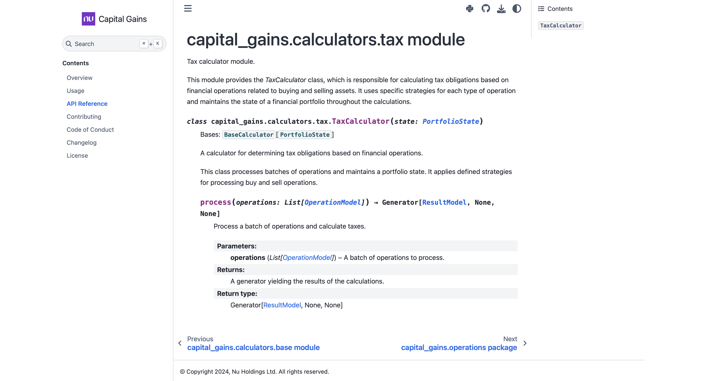
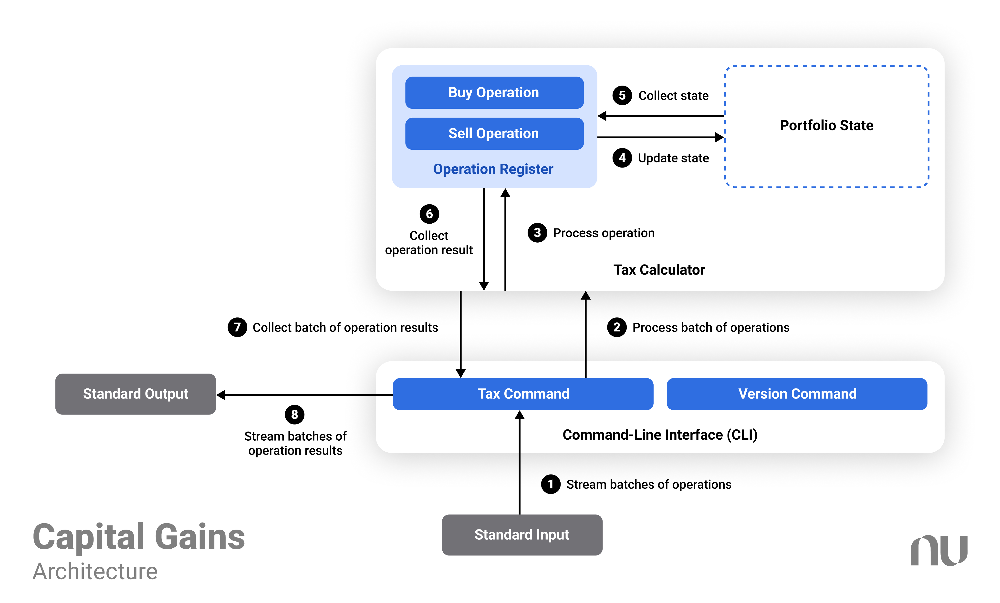
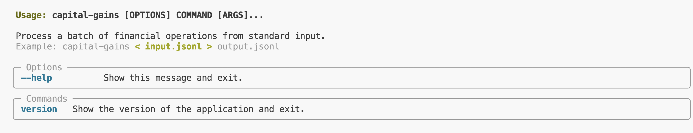

# Review notes

This project template was developed to follow the format of an open-source project by [Nubank on GitHub](https://github.com/nubank). In compliance with interview process guidelines, **the source code and associated artifacts are not actually published on public platforms**, which may lead to broken links or non-applicable commands in the instructions originally intended for the published version of the repository, package, or documentation.


*Documentation for the tool, along with the API reference.*

If you are a reviewer, please refer to the [Contributing Guide](./CONTRIBUTING.md) for instructions on developing the tool and running the documentation, and check the live or source version of the documentation for [usage instructions](./docs/usage.md). The core logic of the implementation is found in the [`capital_gains` module](./capital_gains).


*Overview of the system architecture.*

The command-line interface (CLI) tool is implemented as a Python package and can be developed, installed, and used without any other infrastructure dependencies.


*Help guide for the command-line interface.*

In addition, the project offers a containerized development environment for the tool using [Dev Containers](https://code.visualstudio.com/docs/devcontainers/containers).

To enable anonymization, the `.git` folder was removed, leading to several implications. The pre-commit hooks will no longer function, and the automatic versioning of packages will prevent the environment setup unless `SETUPTOOLS_SCM_PRETEND_VERSION=0.0.0` is exported. However, for the available development environment recipes (Conda and Dev Containers), this variable is already set, so no additional action is required.

The runtime complexity of the implementation is `O(NM)`, where `N` is the number of lines processed and `M` is the average number of operations performed per line. The memory complexity is `O(M)`, as each line is processed lazily, meaning that only one line's operations are held in memory at any time.

This implementation uses the `Decimal` data type to represent financial values, ensuring high precision and accuracy in calculations. Rounding operations are applied only at the input (validation layer) and output (presentation layer), preventing cumulative rounding errors during internal calculations. Financial values will use the shortest float representation with up to two decimal places when required. For more details, refer to [model tests](./tests/test_models.py).

# Capital Gains

A command-line tool for calculating capital gains tax on stock transactions.

## Prerequisites

- [Python (>=3.10.0)](https://www.python.org)

## Installation

Install package:

```console
pip install capital-gains
```

## Documentation

Please refer to the official [Capital Gains Documentation](https://capital-gains.readthedocs.io) for detailed usage instructions.

## Changelog

The [Releases](https://github.com/nubank/capital-gains/releases) page contains information about new features, improvements, and bug fixes for each release.

## Contributing

If you are interested in contributing to this project, please read the [Contributing Guide](https://capital-gains.readthedocs.io/en/stable/contributing.html) for development instructions and guidelines.

## Copyright and license

Copyright (c) 2024, Nu Holdings Ltd. All rights reserved.

Project developed under a [MIT License](https://capital-gains.readthedocs.io/en/stable/license.html).
